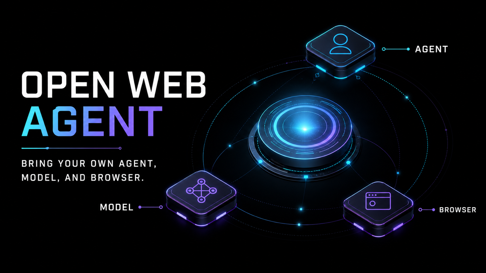
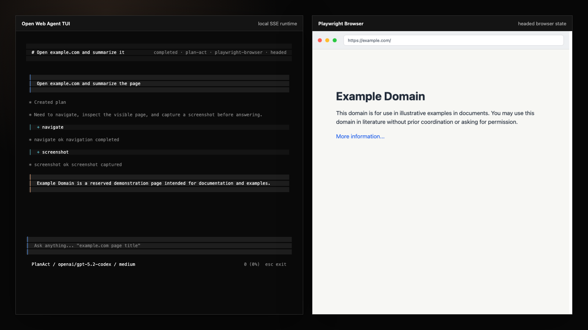

# Open Web Agent



**Open Web Agent is not another browser agent. It is a composable runtime for building, running, and inspecting them.**

Bring your own agent, model provider, and browser environment while keeping one execution loop, one event model, and replayable traces.

## Compose Your Runtime

Open Web Agent separates a web agent into interchangeable runtime boundaries:

| Boundary | What you can plug in | Included today |
|---|---|---|
| **Agent** | Reasoning loops and decision policies | ReAct, SeeAct, and project-local Python agents |
| **Model** | Hosted or custom model providers | OpenAI, OpenRouter, Gemini, Claude, and Codex OAuth |
| **Browser** | Browser environments and typed tool adapters | Playwright |

Swap one boundary without rewriting the rest of the runtime. Open Web Agent keeps orchestration, typed browser actions, cancellation, live events, session persistence, JSONL traces, and replay infrastructure consistent across runs.

The plugin contracts are defined in TypeScript. Project-local Python agents can also call the runtime-selected model, so model selection, lifecycle events, and traces remain centralized.

## Product Preview

The CLI starts a loopback-only Hono server, runs real browser automation, streams every run event over SSE to an OpenTUI client, and persists traces for debugging and replay.



## Quick Start

Install dependencies with Bun:

```bash
bun install
```

Start the TUI from the current project directory:

```bash
bun run packages/cli/src/index.ts
```

Run a headless one-shot task:

```bash
OPENAI_API_KEY=sk-... \
  bun run packages/cli/src/index.ts run "Open example.com and summarize the page"
```

Development aliases point at the same TUI entry:

```bash
bun run dev
bun run owa
```

Without provider credentials, model-backed runs report that no model is configured.

## Documentation

- [How it works](docs/how-it-works.md) — runtime flow, plugin boundaries, local server, and API routes.
- [CLI and TUI](docs/cli.md) — source commands, slash commands, agents, models, and browsers.
- [Configuration](docs/configuration.md) — YAML, environment variables, credentials, and local data paths.
- [Python agents](docs/python-agents.md) — project-local agent manifests and runtime protocols.
- [Evaluation](docs/evaluation.md) — replay fixture comparisons.
- [Development](docs/development.md) — typecheck and test commands for contributors.

The phased build plan remains in [docs/plan/](docs/plan/).
